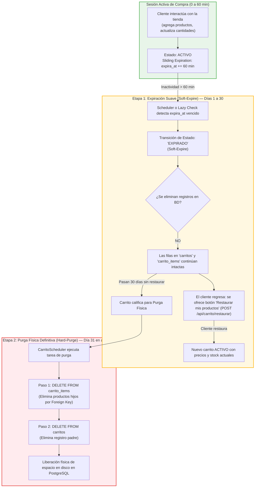

# Arquitectura de Datos: Retención en 2 Etapas y Purga Física del Carrito

Este documento describe el funcionamiento técnico, la justificación de diseño, las consultas SQL y el diagrama de flujo del ciclo de vida del carrito de compras en la base de datos (PostgreSQL), detallando la diferencia entre la **Expiración Suave** (*Soft-Expire*) y la **Purga Física Definitiva** (*Hard-Purge*).

---

## 1. Diagrama de Flujo del Ciclo de Vida



---

## 2. Detalle de las 2 Etapas

### 2.1 Etapa 1: Expiración Suave (*Soft-Expire*, Días 1 al 30)

* **Disparador:** 60 minutos de inactividad del cliente (`expira_at < NOW()`).
* **Estado en Base de Datos:** `estado = 'EXPIRADO'`.
* **Comportamiento en Almacenamiento:** **Cero borrado físico**. La fila principal en la tabla `carritos` y sus elementos relacionados en `carrito_items` permanecen almacenados con sus cantidades y precios históricos.
* **Propósito de Negocio y UX:**
  1. **Evitar frustración:** Si el cliente vuelve al día siguiente o cambia de la computadora al teléfono, no encuentra su carrito vacío; puede presionar **"Restaurar mis productos"** en 1 clic.
  2. **Validación de precios e inventario:** Al restaurar (`POST /api/carrito/restaurar`), el backend revalida el stock actual del inventario y recalcula los precios vigentes, evitando compras con precios congelados obsoletos.
  3. **Campañas de Remarketing:** Permite al equipo de marketing conocer qué productos dejaron los usuarios para enviar recordatorios por correo de carrito abandonado.

---

### 2.2 Etapa 2: Purga Física Definitiva (*Hard-Purge*, Día 31 en adelante)

* **Disparador:** Carritos en estado `EXPIRADO` o `ABANDONADO` con más de 30 días de antigüedad (`actualizado_at < NOW() - INTERVAL '30 days'`).
* **Tipo de Eliminación:** **Hard Delete (Físico)**. Las filas se borran irrevocablemente de PostgreSQL, liberando espacio en disco y optimizando los índices B-Tree.
* **Integridad Referencial (Foreign Keys):**  
  La tabla `carrito_items` cuenta con una restricción de clave foránea `REFERENCES carritos(id)`. Para prevenir errores de violación de integridad referencial (`foreign key constraint violation`), la purga se ejecuta de forma ordenada en **2 pasos atómicos** dentro de una transacción:

#### Consulta SQL del Paso 1 (Eliminar registros dependientes):
```sql
DELETE FROM carrito_items ci
WHERE ci.carrito_id IN (
    SELECT c.id FROM carritos c
    WHERE c.estado IN ('EXPIRADO', 'ABANDONADO')
      AND c.actualizado_at < :limite
);
```

#### Consulta SQL del Paso 2 (Eliminar registros principales):
```sql
DELETE FROM carritos c
WHERE c.estado IN ('EXPIRADO', 'ABANDONADO')
  AND c.actualizado_at < :limite;
```

---

## 3. Configuración en Spring Boot

El tiempo de retención antes de la purga física es 100% configurable mediante `application.properties` sin requerir cambios de código:

```properties
# Días que se conservan los carritos expirados/abandonados para permitir restauración antes de borrarlos físicamente
api.carrito.dias-retencion-expirados=30
```

### Componentes involucrados:
- **`CarritoScheduler.java`:** Orquesta la tarea programada que invoca `purgarCarritosAntiguos()`.
- **`CarritoItemRepository.java`:** Expone la consulta `@Modifying` `purgarItemsDeCarritosAntiguos(limite)`.
- **`CarritoRepository.java`:** Expone la consulta `@Modifying` `purgarCarritosAntiguos(limite)`.

---

## 4. Comparativa: ¿Por qué es superior a borrar de inmediato?

| Criterio | Borrado Inmediato (Anterior) | Retención en 2 Etapas (Actual) |
|---|---|---|
| **Experiencia de Usuario (UX)** | Carrito vacío al volver a la tienda. Sensación de error técnico. | Aviso claro con opción de restaurar productos en 1 solo clic. |
| **Conversión de Ventas** | El usuario debe buscar cada producto de nuevo. ~80% abandona. | Recuperación inmediata de la intención de compra. |
| **Integridad de Inventario** | No hay reserva en carrito; se protege contra bloqueos. | No hay reserva en carrito; se protege contra bloqueos. |
| **Mantenimiento de BD** | Borraba de golpe a la hora. | Conserva 30 días para marketing/UX y purga automáticamente sin saturar la BD. |
