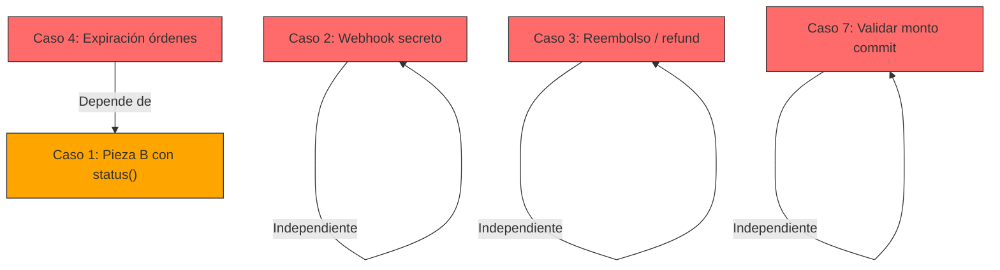

# Diagnóstico — Webpay Casos Borde Pendientes vs. Estado Actual del Proyecto

> Comparación del documento [Webpay-Casos-Borde-Pendientes.md](file:///C:/Users/alexe/Desktop/2026-Projects/e-commerce/ecommerce/backend/docs/Webpay-Casos-Borde-Pendientes.md) contra el código actual del backend y frontend.

---

## Tabla Resumen

| Caso | Severidad | Estado | Detalle |
|------|-----------|--------|---------|
| 1. Usuario fantasma / doble cobro | 🔴 ALTO | ⚠️ **PARCIALMENTE RESUELTO** | Scheduler + `status()` implementados, pero Pieza B sin `status()` |
| 2. Webhook sin secreto | 🔴 ALTO | ❌ **PENDIENTE** | Sin validación del header `X-Webhook-Secret` |
| 3. Reembolso autorizado por admin | 🔴 ALTO | ❌ **PENDIENTE** | No existen estados ni endpoint de refund |
| 4. Órdenes PENDIENTE sin expiración | 🟡 MEDIO | ❌ **PENDIENTE** | No existe `OrdenExpiracionScheduler` |
| 5. Polling del estado del pago | 🟡 MEDIO | ✅ **RESUELTO** | Frontend + backend implementados |
| 6. Retorno POST en integración | 🟢 BAJO | ⏭️ **DIFERIBLE** | Limitación documentada en el doc |
| 7. Validar monto del commit | 🟢 BAJO | ❌ **PENDIENTE** | `procesarAprobada` no valida monto |
| 8. `returnUrl` duplicado | 🟢 BAJO | ✅ **RESUELTO** | Frontend ya no envía `returnUrl` |

---

## Análisis Detallado por Caso

### Caso 1 — "Usuario fantasma" / doble cobro ⚠️ PARCIALMENTE RESUELTO

**Lo que SÍ está implementado:**
- ✅ [`WebpayTransaccionRepository.findByEstadoAndCreadoAtBefore()`](file:///C:/Users/alexe/Desktop/2026-Projects/e-commerce/ecommerce/backend/src/main/java/com/jeplabs/ecommerce/domain/pago/webpay/WebpayTransaccionRepository.java) — query para buscar transacciones huérfanas.
- ✅ [`WebpayReconciliacionScheduler`](file:///C:/Users/alexe/Desktop/2026-Projects/e-commerce/ecommerce/backend/src/main/java/com/jeplabs/ecommerce/domain/pago/webpay/WebpayReconciliacionScheduler.java) — scheduler `@Scheduled` cada 15 min que llama a `reconciliarTransaccionesExpiradas(15)`.
- ✅ [`verificarYActualizarEstadoTransaccion()`](file:///C:/Users/alexe/Desktop/2026-Projects/e-commerce/ecommerce/backend/src/main/java/com/jeplabs/ecommerce/domain/pago/webpay/WebpayService.java#L184-L208) — consulta `Transaction.status(token)` y clasifica correctamente: `AUTHORIZED` → `procesarAprobadaStatus()`, `FAILED` → `REJECTED`, timeout → `TIMEOUT`.
- ✅ [`consultarEstado()`](file:///C:/Users/alexe/Desktop/2026-Projects/e-commerce/ecommerce/backend/src/main/java/com/jeplabs/ecommerce/domain/pago/webpay/WebpayService.java#L130-L140) — ahora consulta Transbank activamente si la transacción está `INICIADA`.

**Lo que FALTA — Pieza B sin `status()`:**

> [!WARNING]
> En [`iniciar()`](file:///C:/Users/alexe/Desktop/2026-Projects/e-commerce/ecommerce/backend/src/main/java/com/jeplabs/ecommerce/domain/pago/webpay/WebpayService.java#L50-L59) (líneas 50-59), cuando hay una transacción `INICIADA` que lleva más de 10 minutos, se marca directamente como `TIMEOUT` **sin consultar `status(token)` primero**.
>
> Esto permite el escenario de **doble cobro**: el cliente pagó, cerró la pestaña, y al reintentar se marca la transacción pagada como `TIMEOUT` y se crea una nueva.

**Código actual (problemático):**
```java
// WebpayService.java líneas 55-59
} else {
    // Si ya expiró el token de Webpay, marcamos TIMEOUT y permitimos crear una nueva
    tx.rechazar(MotivoRechazoWebpay.TIMEOUT, null);
    transaccionRepositorio.save(tx);
}
```

**Lo que debería hacer (según el documento):**
```java
} else {
    // Antes de marcar TIMEOUT, verificar en Transbank si el pago fue exitoso
    verificarYActualizarEstadoTransaccion(tx, 10);
    if (tx.estaAprobada()) {
        // La orden SÍ fue pagada: NO crear una nueva
        return new DatosRespuestaIniciarWebpay(tx.getToken(), tx.getUrl());
    }
    // Si no fue aprobada, sí se puede crear una nueva
}
```

**Impacto**: Sin este cambio, una transacción que fue aprobada en Transbank pero cuyo retorno se perdió será incorrectamente marcada como `TIMEOUT` cuando el usuario reintente, creando una transacción duplicada (doble cobro).

---

### Caso 2 — Webhook sin validar secreto ❌ PENDIENTE

**Estado actual en** [`WebpayController.java`](file:///C:/Users/alexe/Desktop/2026-Projects/e-commerce/ecommerce/backend/src/main/java/com/jeplabs/ecommerce/controller/WebpayController.java#L61-L74):

```java
// Líneas 62-74: El header "X-Webhook-Secret" se recibe pero NUNCA se valida
@PostMapping("/webhook")
public ResponseEntity<Void> webhook(
        @RequestParam(value = "token_ws", required = false) String tokenWs,
        @RequestHeader(value = "X-Webhook-Secret", required = false) String secret) {
    // Validar que viene de Transbank
    // En producción comparar con api.webpay.webhook-secret  ← SOLO UN COMENTARIO
    if (tokenWs != null) {
        service.procesarWebhook(tokenWs);
    }
    return ResponseEntity.ok().build();
}
```

> [!CAUTION]
> **Riesgo de seguridad**: cualquier tercero puede hacer `POST /api/pagos/webpay/webhook?token_ws=xxx` y ejecutar `commit(token)` sobre transacciones arbitrarias. El endpoint está configurado como `permitAll` en `SecurityConfigurations.java`.

**Qué falta:**
1. Inyectar `@Value("${api.webpay.webhook-secret}")` en el controller.
2. Comparar el header recibido con el secreto configurado.
3. Retornar `401 UNAUTHORIZED` si no coincide.
4. Asegurar que exista la property en `application.properties`.

---

### Caso 3 — Cancelar orden CONFIRMADA sin reembolso ❌ PENDIENTE

**Estado actual:**

- [`EstadoOrden.java`](file:///C:/Users/alexe/Desktop/2026-Projects/e-commerce/ecommerce/backend/src/main/java/com/jeplabs/ecommerce/domain/orden/EstadoOrden.java) — **no tiene** estados `ANULADO` ni `REEMBOLSADO`.
- [`EstadoWebpayTransaccion.java`](file:///C:/Users/alexe/Desktop/2026-Projects/e-commerce/ecommerce/backend/src/main/java/com/jeplabs/ecommerce/domain/pago/webpay/EstadoWebpayTransaccion.java) — **no tiene** estado `REEMBOLSADA`.
- [`WebpayTransaccion.java`](file:///C:/Users/alexe/Desktop/2026-Projects/e-commerce/ecommerce/backend/src/main/java/com/jeplabs/ecommerce/domain/pago/webpay/WebpayTransaccion.java) — **no tiene** método `marcarReembolsada()`.
- [`WebpayService.java`](file:///C:/Users/alexe/Desktop/2026-Projects/e-commerce/ecommerce/backend/src/main/java/com/jeplabs/ecommerce/domain/pago/webpay/WebpayService.java) — **no tiene** método `reembolsar()`.
- [`WebpayController.java`](file:///C:/Users/alexe/Desktop/2026-Projects/e-commerce/ecommerce/backend/src/main/java/com/jeplabs/ecommerce/controller/WebpayController.java) — **no tiene** endpoint de reembolso.
- [`OrdenService.cancelarMiOrden()`](file:///C:/Users/alexe/Desktop/2026-Projects/e-commerce/ecommerce/backend/src/main/java/com/jeplabs/ecommerce/domain/orden/OrdenService.java#L225-L234) — cancela **cualquier** orden cancelable (`PENDIENTE` o `CONFIRMADA`) de la misma manera: `cancelar()` + `devolverStock()`, **sin distinguir** si ya fue pagada.

> [!WARNING]
> Si un cliente cancela una orden `CONFIRMADA` (ya pagada via Webpay), el stock se devuelve pero el dinero **no se reembolsa**. No hay flujo de `Transaction.refund()`.

**Qué falta (según el documento):**
1. Estados nuevos: `ANULADO`, `REEMBOLSADO` en `EstadoOrden` + `REEMBOLSADA` en `EstadoWebpayTransaccion`.
2. Método `marcarReembolsada()` en `WebpayTransaccion`.
3. Método `reembolsar()` en `WebpayService` que llame a `Transaction.refund()`.
4. Endpoint admin `POST /{ordenId}/reembolsar` en `WebpayController`.
5. Diferenciar en `cancelarMiOrden`: `PENDIENTE → CANCELADA` vs `CONFIRMADA → ANULADO` (sin devolver stock hasta reembolso).
6. Migración Flyway para los nuevos estados.

---

### Caso 4 — Órdenes PENDIENTE sin expiración automática ❌ PENDIENTE

**Estado actual:**
- [`OrdenRepository.java`](file:///C:/Users/alexe/Desktop/2026-Projects/e-commerce/ecommerce/backend/src/main/java/com/jeplabs/ecommerce/domain/orden/OrdenRepository.java) — **no tiene** `findByEstadoAndCreadoAtBefore()`.
- **No existe** `OrdenExpiracionScheduler` (confirmado: 0 resultados en búsqueda).
- **No existe** `expiracionAutomatica()` en `OrdenService`.

> [!IMPORTANT]
> Las órdenes `PENDIENTE` con stock reservado quedan **indefinidamente** si el cliente nunca paga ni cancela. Solo existe `CarritoScheduler` para limpiar carritos abandonados, pero no hay equivalente para órdenes.

**Qué falta:**
1. `findByEstadoAndCreadoAtBefore()` en `OrdenRepository`.
2. `OrdenExpiracionScheduler` que busque órdenes `PENDIENTE` expiradas y las cancele (con reconciliación previa vía Caso 1 para no cancelar una orden pagada).
3. `expiracionAutomatica()` en `OrdenService`.
4. Properties configurables: `api.orden.expiracion-minutos`.

**Dependencia**: Este caso depende de que el Caso 1 (Pieza B) esté correctamente implementado, ya que necesita verificar `status()` antes de cancelar para no cancelar una orden pagada.

---

### Caso 5 — Polling del estado del pago ✅ RESUELTO

**Verificaciones:**
- ✅ [`consultarEstadoWebpay()`](file:///C:/Users/alexe/Desktop/2026-Projects/e-commerce/ecommerce/frontend/src/features/checkout/api/paymentGatewayApi.ts) en el frontend llama a `GET /api/pagos/webpay/estado/{ordenId}`.
- ✅ [`useCheckoutLogic.ts`](file:///C:/Users/alexe/Desktop/2026-Projects/e-commerce/ecommerce/frontend/src/features/checkout/model/useCheckoutLogic.ts) importa y usa `consultarEstadoWebpay` con efecto de polling (backoff + visibilidad + reanudación desde `sessionStorage`).
- ✅ [`consultarEstado()`](file:///C:/Users/alexe/Desktop/2026-Projects/e-commerce/ecommerce/backend/src/main/java/com/jeplabs/ecommerce/domain/pago/webpay/WebpayService.java#L130-L140) en el backend consulta activamente Transbank con `status()` si la transacción está `INICIADA`.
- ✅ Endpoint `GET /api/pagos/webpay/estado/{ordenId}` existe y está `permitAll`.

**Conclusión**: Completamente implementado en frontend y backend.

---

### Caso 6 — Retorno POST en integración ⏭️ DIFERIBLE

**Severidad baja**. El documento lo marca como una limitación conocida del ambiente de integración de Transbank (el retorno abortado llega por POST, pero el SPA solo lee query params GET). En producción (API v1.1+) es GET.

**Acción recomendada**: Solo documentar. Opcionalmente crear un endpoint puente si se necesita testear abort en integración.

---

### Caso 7 — Validar monto del commit ❌ PENDIENTE

**Estado actual en** [`procesarAprobada()`](file:///C:/Users/alexe/Desktop/2026-Projects/e-commerce/ecommerce/backend/src/main/java/com/jeplabs/ecommerce/domain/pago/webpay/WebpayService.java#L211-L246):

```java
// No hay ninguna comparación de response.getAmount() vs transaccion.getMonto()
private DatosRespuestaConfirmarWebpay procesarAprobada(
        WebpayTransaccion transaccion,
        WebpayPlusTransactionCommitResponse response) {
    transaccion.aprobar(...);  // Aprueba directamente sin validar monto
    // ...
}
```

> [!NOTE]
> Severidad baja pero es una defensa en profundidad recomendable. Si Transbank devuelve un monto distinto al esperado, la orden no debería confirmarse.

**Qué falta**: Agregar validación antes de `transaccion.aprobar()`:
```java
if (response.getAmount() != transaccion.getMonto().intValue()) {
    transaccion.rechazar(MotivoRechazoWebpay.REJECTED, response.getResponseCode());
    return DatosRespuestaConfirmarWebpay.fallido("Monto no coincide", MotivoRechazoWebpay.REJECTED);
}
```

---

### Caso 8 — `returnUrl` duplicado ✅ RESUELTO

**Verificación**: `returnUrl` no aparece en ningún archivo del frontend (`paymentGatewayApi.ts`, `useCheckoutLogic.ts`, `CheckoutReturn.tsx`). El frontend envía solo `{ ordenId }` al iniciar Webpay, y el backend usa exclusivamente `@Value("${api.webpay.return-url}")`.

---

## Diagrama de Dependencias



## Orden de Implementación Recomendado

| Prioridad | Caso | Justificación |
|-----------|------|---------------|
| 1º | **Caso 1** — Corregir Pieza B | Prerequisito del Caso 4. Elimina riesgo de doble cobro. Cambio pequeño y localizado. |
| 2º | **Caso 2** — Webhook secreto | Riesgo de seguridad alto. Cambio pequeño (~10 líneas). |
| 3º | **Caso 7** — Validar monto | Cambio pequeño (~5 líneas). Defensa en profundidad. |
| 4º | **Caso 4** — Expiración de órdenes | Libera stock retenido. Depende de que Caso 1 esté corregido. |
| 5º | **Caso 3** — Reembolso | Cambio más extenso: estados nuevos, migración, endpoint, correos. Requiere decisiones de diseño. |
| 6º | **Caso 6** — Retorno POST | Opcional. Solo para integración. |
