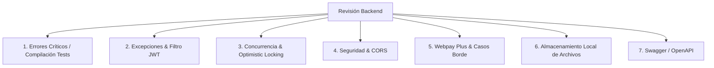

# Plan de Análisis, Correcciones y Mejoras del Backend (Spring Boot)

## Descripción General
Este documento presenta el análisis técnico integral del código backend de la plataforma de E-Commerce (`com.jeplabs.ecommerce`). Identifica problemas de compilación en pruebas unitarias, inconsistencias en el manejo de excepciones, brechas en la configuración de seguridad y CORS, casos borde en el flujo de pagos (Webpay Plus), falta de configuración para servir archivos locales y la cobertura faltante de documentación Swagger / OpenAPI.

---

## Hallazgos Principales y Diagnóstico



---

## 1. Correcciones Críticas (Bugs y Compilación)

### 1.1 Incompatibilidad en Tests (`OrdenServiceTest.java`)
> [!IMPORTANT]
> Los tests automatizados (`mvn test`) fallan en compilación debido a cambios en el constructor de `Orden`.
- **Causa:** La entidad `Orden` agregó el campo `metodoPagoCodigo` a su constructor principal, pero en `OrdenServiceTest.java` (líneas 317, 332, 365, 389) se sigue llamando al constructor antiguo con una lista de argumentos distinta.
- **Ajuste:** Actualizar las instancias de prueba en `OrdenServiceTest.java` para proveer el argumento correspondiente al método de pago (ej. `"TRANSFERENCIA"` o `"WEBPAY"`).

### 1.2 Bloqueo Optimista en Concurrencia (`Producto.java` y `OrdenService.java`)
> [!WARNING]
> `OrdenService` captura `ObjectOptimisticLockingFailureException` al descontar stock, pero la entidad `Producto` carece de la anotación `@Version`.
- **Causa:** Sin `@Version private Long version;` en `Producto`, JPA/Hibernate no realiza chequeo de versión concurrente. Dos compras simultáneas del último producto pueden causar condiciones de carrera (*race condition*).
- **Ajuste:** Agregar el campo `@Version private Long version;` en `Producto` y su respectiva columna en la base de datos si aplica.

---

## 2. Manejo de Excepciones y Filtro de Seguridad JWT

### 2.1 Excepciones en el Filtro (`FiltroSeguridad.java` / `TokenService.java`)
> [!IMPORTANT]
> Si el token JWT es inválido o expira, `TokenService.getSubject()` lanza un `RuntimeException("Token inválido o expirado")`. Al lanzarse dentro del `OncePerRequestFilter`, no llega al `@RestControllerAdvice` y provoca un error HTTP 500 en lugar de delegar al `JwtAuthenticationEntryPoint` (HTTP 401 Unauthorized).
- **Ajuste:** En `FiltroSeguridad`, capturar la excepción de verificación JWT y permitir que la cadena de filtros continúe sin autenticar el `SecurityContext`, permitiendo que Spring Security invoque limpiamente el `JwtAuthenticationEntryPoint`.

### 2.2 Inconsistencia de Excepciones de Dominio (`CarritoService.java`)
- Existen clases especializadas como `CarritoNoEncontradoException`, `ProductoNoDisponibleException`, y `StockInsuficienteException` ya mapeadas en `GestorDeErrores.java`.
- Sin embargo, `CarritoService.java` actualmente lanza `IllegalArgumentException` genéricos para esas situaciones (ej. `"No tienes un carrito activo"`, `"El producto no está disponible para compra"`, `"Stock insuficiente..."`).
- **Ajuste:** Unificar el lanzamiento de las excepciones específicas en `CarritoService` para mantener coherencia en los códigos y mensajes de respuesta.

### 2.3 Manejo de Errores Adicionales en `GestorDeErrores.java`
- Añadir manejadores para:
  - `MaxUploadSizeExceededException` (para subida de comprobantes que excedan el límite de 5MB, devolviendo HTTP 400 en lugar de 500).
  - `NoSuchElementException` / `EntityNotFoundException` (HTTP 404).

---

## 3. Seguridad y Configuración CORS

### 3.1 Configuración de CORS en Spring Security 6 / Spring Boot 3
- En `SecurityConfigurations.java`, la llamada `.cors(cors -> cors.configure(http))` es no canónica.
- Para que las peticiones pre-flight `OPTIONS` del navegador sean procesadas correctamente antes de los filtros de seguridad, se debe configurar un `CorsConfigurationSource` registrado como `@Bean` y llamar a `.cors(Customizer.withDefaults())`.

---

## 4. Pasarela de Pago Webpay Plus (Casos Borde y Reconciliación)

Basado en la documentación técnica del proyecto (`docs/Webpay-Casos-Borde-Pendientes.md`):
- **Transacciones Huérfanas / "Usuario Fantasma":** Si un cliente paga pero se pierde la conexión antes de volver al callback, la transacción queda en estado `INICIADA`.
- **Ajustes requeridos:**
  1. Crear un scheduler de reconciliación (`WebpayReconciliacionScheduler`) que consulte `webpayConfig.crearTransaction().status(token)` para transacciones con más de 10 minutos en `INICIADA`.
  2. En `WebpayService.iniciar()`, verificar el estado real en Transbank antes de reintentar para evitar doble cobro.
  3. Soporte para el retorno con parámetros de abort (`TBK_TOKEN`, `TBK_ID_SESION`, `TBK_ORDEN_COMPRA`).

---

## 5. Almacenamiento Local y Entrega de Archivos (`LocalStorageService`)

- Cuando se usa el proveedor de almacenamiento local (`api.storage.provider=local`), los comprobantes se guardan en `uploads/comprobantes/...`.
- **Ajuste:** Configurar un `ResourceHandler` en Spring Web MVC (`addResourceHandlers`) o un endpoint protegido para que los administradores puedan visualizar y descargar los comprobantes subidos por los clientes.

---

## 6. Cobertura de Documentación Swagger / OpenAPI (SpringDoc)

Controladores que actualmente carecen de anotaciones OpenAPI (`@Tag`, `@Operation`, `@ApiResponses`):
- `CarritoController.java`
- `DireccionController.java`
- `ServicioEnvioController.java`
- Completar respuestas y descripciones en `ConfiguracionController.java` y `PerfilController.java`.

---

## Plan de Verificación

### Pruebas Automatizadas
1. Ejecución de la suite completa de pruebas:
   ```bash
   ./mvnw clean test
   ```
2. Verificación de compilación de pruebas de integración y controladores.

### Verificación Manual / Funcional
- Inspección de Swagger UI en `http://localhost:8080/swagger-ui.html` para validar que todos los endpoints y esquemas queden documentados.
- Verificación del flujo de autenticación con tokens vencidos para confirmar respuesta HTTP 401 en lugar de 500.
