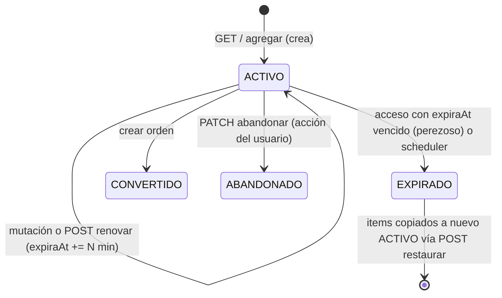

# Plan: Sincronización y Expiración del Carrito

## 1. Opinión sobre el documento

### ✅ Lo que el documento acierta
| Punto | Comentario |
|---|---|
| Webhooks no sirven para el navegador | Correcto. Son server-to-server. |
| Descartar Polling y WebSockets | Correcto. Polling además impediría la expiración si renovara en cada GET. |
| Enfoque híbrido (TTL en respuesta + revalidación en `visibilitychange`) | Es el estándar de la industria y la opción correcta para este stack. |
| `GET` no debe renovar la expiración | Correcto: un `GET` debe ser seguro; si renovara, una pestaña abierta mantendría el carrito vivo para siempre. |
| Nunca vaciar la UI en silencio | Correcto y es justo lo que hace hoy `useCartLogic` (`setItems([])` al detectar "expir"). |

### ⚠️ Lo que el documento omite o plantea de forma incorrecta frente al código real

> [!IMPORTANT]
> **1. Parte de cero, pero el backend ya tiene gran parte de esto.**
> `carritos.expira_at` existe desde la migración `V9`, `DatosRespuestaCarrito` ya devuelve `expiraAt`, existe `CarritoScheduler` (aviso por email + vaciado) y `Carrito.renovarExpiracion()`. Los endpoints reales son `/api/carrito` (no `/api/cart`). No hace falta "agregar la columna"; hace falta **cerrar los huecos**.

> [!WARNING]
> **2. El riesgo de negocio real no es el stock: es el precio congelado.**
> El documento habla de "reservas" y de "productos liberados para otros compradores". **El carrito no reserva inventario**: `validarStock` solo consulta y el stock se descuenta recién en `OrdenService.crear`. Lo que el carrito sí congela es el **precio** (`CarritoItem.precioUnitario` se fija al agregar, y `OrdenService.crear` lo usa directamente en la línea 160).
> Por eso: (a) el texto de UX *"tus productos fueron liberados para otros compradores"* sería **falso**; el mensaje correcto es *"los precios pueden haber cambiado"*; y (b) la cuenta regresiva con urgencia ("tu reserva vence") comunica algo que el sistema no garantiza.

> [!CAUTION]
> **3. Hueco de consistencia: entre que el carrito expira y que corre el scheduler, el carrito sigue siendo usable.**
> El scheduler corre cada `PT10M` en dev. Durante esa ventana el carrito expirado sigue en estado `ACTIVO`: `GET` lo devuelve con sus items y **`OrdenService.crear` crea la orden con precios vencidos**, porque no verifica `estaExpirado()`.

**4. La renovación por actividad (sliding expiration) está incompleta.** Solo `agregarItem` renueva. `actualizarCantidad` y `eliminarItem` no lo hacen: un usuario que solo ajusta cantidades puede quedarse sin carrito estando activo.

**5. Zona horaria y desfase de reloj.** `expiraAt` es `LocalDateTime` y se serializa **sin offset** (`"2026-10-04T23:15:00"`). El navegador lo interpreta en *su* hora local. Si el servidor corre en UTC (lo habitual en Docker o la nube) y el cliente está en Guatemala (UTC-6), el contador queda desfasado 6 horas. Además, el reloj del cliente puede estar desajustado. La práctica correcta es que el **servidor calcule los segundos restantes**.

**6. Contrato de error frágil.** El frontend detecta la expiración con `message.includes('expir')`. Cualquier cambio en el texto del mensaje rompe la detección. Hace falta un **código de error estable** y un **status HTTP semántico** (`410 Gone`).

**7. El vaciado elimina los items.** El scheduler hace `itemRepositorio.deleteAll(...)`. Así no hay forma de ofrecer desde el servidor un "restaurar mis productos" confiable (que sobreviva a una recarga de página o a un cambio de dispositivo). La alternativa del documento depende de que el frontend aún tenga los items en memoria.

**8. `Carrito.estaExpirado()` lanza NPE si `expiraAt` es `null`.** No ocurre en BD (la columna es `NOT NULL`), pero sí en entidades en memoria o en tests.

---

## 2. Solución propuesta (backend)

### Principios
1. **Expiración perezosa + scheduler.** El servidor verifica la expiración **en cada acceso** (fuente de verdad inmediata). El scheduler queda solo como limpieza y envío de emails.
2. **Sliding expiration en toda mutación** y renovación manual explícita. `GET` nunca renueva.
3. **Contrato inmune a la zona horaria:** `segundosRestantes`, calculado en el servidor.
4. **Errores semánticos:** `410 Gone` + `codigo: "CARRITO_EXPIRADO"`.
5. **Expiración suave (soft-expire):** se conservan los items y se agrega un estado `EXPIRADO` para poder restaurarlos con **precios y stock actuales**.

### Flujo de estados



### Reglas por endpoint

| Endpoint | Carrito vigente | Carrito vencido |
|---|---|---|
| `GET /api/carrito` | 200, **no** renueva | Marca `EXPIRADO`, crea uno nuevo vacío → 200 con `expiracion.carritoAnteriorExpirado = true` |
| `POST /items` | 200, renueva | Marca `EXPIRADO`, crea uno nuevo, agrega el item → 200 con `carritoAnteriorExpirado = true` (respeta la intención del usuario) |
| `PATCH/DELETE /items/{id}` | 200, **renueva** (hoy no lo hace) | **410** `CARRITO_EXPIRADO` (el `itemId` ya no pertenece a un carrito vigente) |
| `DELETE /api/carrito` (vaciar) | 200, renueva | 410 |
| `POST /api/carrito/renovar` **[NUEVO]** | 200, renueva | 410 |
| `POST /api/carrito/restaurar` **[NUEVO]** | Copia los items del último carrito `EXPIRADO` con precio y stock actuales → 200 + lista de items no restaurados | — |
| `POST /api/ordenes` (checkout) | Igual que hoy | **410** (impide crear órdenes con precios vencidos) |

---

## 3. Cambios propuestos

### Dominio `carrito`

#### [MODIFY] [EstadoCarrito.java]
```diff
 public enum EstadoCarrito {
     ACTIVO,
     ABANDONADO,
-    CONVERTIDO
+    CONVERTIDO,
+    EXPIRADO
 }
```
> [!NOTE]
> No requiere migración: `estado` es `VARCHAR(20)` sin `CHECK`. Es compatible con H2.

#### [MODIFY] [Carrito.java]
```java
public boolean estaExpirado() {
    return expiraAt != null && !LocalDateTime.now().isBefore(expiraAt);   // null-safe
}

/** Sliding expiration: toda interacción del usuario renueva el TTL. */
public void registrarActividad(long minutos) {
    renovarExpiracion(minutos);
}

/** Soft-expire: conserva los items para poder restaurarlos. */
public void marcarComoExpirado() {
    this.estado = EstadoCarrito.EXPIRADO;
    this.actualizadoAt = LocalDateTime.now();
}

public long segundosRestantes() {
    if (expiraAt == null) return 0;
    return Math.max(0, Duration.between(LocalDateTime.now(), expiraAt).getSeconds());
}
```

#### [NEW] `DatosExpiracionCarrito.java`
```java
public record DatosExpiracionCarrito(
        LocalDateTime expiraAt,          // referencia/auditoría
        long segundosRestantes,          // ← fuente de verdad para el contador del frontend
        long ttlTotalSegundos,           // permite calcular el % para la barra de progreso
        long avisoSegundosAntes,         // umbral de pre-alerta (= notificacion-minutos-antes)
        boolean carritoAnteriorExpirado  // señal explícita para mostrar el modal
) {}
```

#### [MODIFY] [DatosRespuestaCarrito.java]
Se agrega `DatosExpiracionCarrito expiracion`. **Se mantiene `expiraAt` en el nivel superior** para no romper el schema Zod actual del frontend.

#### [NEW] `DatosRespuestaRestauracion.java`
```java
public record DatosRespuestaRestauracion(
        DatosRespuestaCarrito carrito,
        List<ItemNoRestaurado> itemsNoRestaurados
) {
    public record ItemNoRestaurado(Long productoId, String nombre, String motivo) {}
    // motivo: "SIN_STOCK" | "STOCK_PARCIAL" | "NO_DISPONIBLE" | "SIN_PRECIO"
}
```

#### [MODIFY] [CarritoRepository.java]
```java
Optional<Carrito> findFirstByUsuarioIdAndEstadoOrderByActualizadoAtDesc(Long usuarioId, EstadoCarrito estado);
```

#### [MODIFY] [CarritoService.java]
Puntos clave:
```java
// GET y agregarItem: tolerantes → si venció, expira el viejo y crea uno nuevo
private ResultadoCarrito obtenerOCrearCarritoVigente(Usuario usuario) {
    return carritoRepositorio.findByUsuarioIdAndEstado(usuario.getId(), EstadoCarrito.ACTIVO)
            .map(c -> {
                if (!c.estaExpirado()) return new ResultadoCarrito(c, false);
                c.marcarComoExpirado();
                return new ResultadoCarrito(crearNuevo(usuario), true);
            })
            .orElseGet(() -> new ResultadoCarrito(crearNuevo(usuario), false));
}

// Mutaciones sobre itemId / vaciar / renovar: estrictas → 410
private Carrito obtenerCarritoVigenteOFallar(String email) {
    Carrito c = obtenerCarritoActivo(email);
    if (c.estaExpirado()) {
        c.marcarComoExpirado();       // se persiste porque el commit ocurre antes de la excepción? → ver nota
        throw new CarritoExpiradoException();
    }
    return c;
}
```
> [!NOTE]
> Una `RuntimeException` hace *rollback* de `@Transactional`, así que `marcarComoExpirado()` no se persistiría en la rama estricta. No es un problema: el próximo `GET` o el scheduler lo marcarán. Para no dejar código engañoso, en la rama estricta **solo se lanza la excepción**, sin marcar.

- `actualizarCantidad`, `eliminarItem` y `vaciarCarrito` → `carrito.registrarActividad(expiracionMinutos)`.
- **[NUEVO]** `renovar(email)`.
- **[NUEVO]** `restaurar(email)`: toma el último carrito `EXPIRADO`. Por cada item: valida que el producto sea comprable, lo agrega con la **cantidad acotada al stock** y el **precio vigente** (`obtenerPrecioActual`) y reporta los items que no pudo restaurar. Si un producto ya está en el carrito activo, suma la cantidad (acotada al stock). Al final, el carrito origen se marca `ABANDONADO` para que no pueda restaurarse dos veces (idempotencia).

---

### Checkout

#### [MODIFY] [OrdenService.java]
```diff
         Carrito carrito = carritoRepositorio
                 .findByUsuarioIdAndEstado(usuario.getId(), EstadoCarrito.ACTIVO)
                 .orElseThrow(CarritoNoEncontradoException::new);

+        if (carrito.estaExpirado()) {
+            throw new CarritoExpiradoException();
+        }
+
         if (carrito.getItems().isEmpty()) {
```

---

### Controller y errores

#### [MODIFY] [CarritoController.java]
`POST /api/carrito/renovar` y `POST /api/carrito/restaurar`, con anotaciones OpenAPI (incluida la respuesta `410`) en todos los endpoints afectados.

#### [NEW] `infra/exceptions/CarritoExpiradoException.java`

#### [MODIFY] [GestorDeErrores.java]
```java
@ExceptionHandler(CarritoExpiradoException.class)
public ResponseEntity<Map<String, String>> manejarCarritoExpirado(CarritoExpiradoException ex) {
    return ResponseEntity.status(HttpStatus.GONE)   // 410: existió, ya no está vigente
            .body(Map.of("error", ex.getMessage(), "codigo", "CARRITO_EXPIRADO"));
}
```
> [!NOTE]
> Se usa `410` en lugar de `401` o `404`: el interceptor `http-session.ts` destruye la sesión ante un `401` (la misma lección de la fuga de status de QPayPro), y `404` es ambiguo.

---

### Scheduler

#### [MODIFY] [CarritoScheduler.java]
- `vaciarCarritosExpirados` → `marcarComoExpirado()` **sin borrar items** (soft-expire).
- `try/catch` por carrito alrededor del envío de email, con `log.warn`: hoy un fallo SMTP lanza una excepción dentro del `@Transactional` y hace *rollback* de **todo el lote**.
- Se agrega `@Slf4j` y se reemplaza el FQN `java.time.Duration` por un `import`.

---

### Documentación para el equipo frontend

#### [NEW] `backend/docs/Uso-Expiracion-Carrito-Frontend.md`
Contenido (no se modifica código del frontend):
1. **Contrato JSON** del objeto `expiracion` y el schema Zod sugerido.
2. **Temporizador:** `deadline = performance.now() + segundosRestantes * 1000`. **No** parsear `expiraAt` (desfase de zona horaria y de reloj). Recalcular el deadline en cada respuesta del carrito.
3. **Revalidación:** `visibilitychange` → `refreshCart()` en `CartProvider` (el patrón ya existe en `ProductDetailView` y `useCheckoutLogic`), y también al entrar a `/checkout`.
4. **Errores:** detectar `status === 410 && body.codigo === 'CARRITO_EXPIRADO'` y **eliminar la comparación de textos** (`includes('expir')`).
5. **UX con mensajes veraces:**
   - Pre-alerta cuando `segundosRestantes <= avisoSegundosAntes`, con botón **"Extender tiempo"** → `POST /renovar`.
   - Modal de expiración: *"Tu carrito expiró por inactividad. Los precios pueden haber cambiado."* → **[Restaurar mis productos]** (`POST /restaurar`, mostrando `itemsNoRestaurados`) o **[Ver catálogo]**.
   - **No** usar el texto *"liberados para otros compradores"* (no hay reserva de stock).
   - Contador discreto (sin rojo parpadeante): no hay escasez real que comunicar.
6. **Diagrama de secuencia** del flujo completo y tabla de endpoints y respuestas.

---

## 4. Preguntas abiertas

> [!IMPORTANT]
> **P1. ¿Expiración suave (conservar items + `/restaurar`) o mantener el borrado actual?**
> Recomiendo la expiración suave: permite restaurar desde el servidor (sobrevive a recargas y cambios de dispositivo), sirve para analítica de carritos abandonados y no tiene costo de stock. La contra es que las filas de `carrito_items` crecen; más adelante puede agregarse una purga de carritos `EXPIRADO` con más de N días.

> [!IMPORTANT]
> **P2. Al agregar un producto con el carrito vencido, ¿crear uno nuevo de forma transparente (con `carritoAnteriorExpirado = true`) o responder 410?**
> Recomiendo crearlo de forma transparente: respeta la intención del usuario y el frontend igual puede mostrar el aviso con opción de restaurar.

**P3. ¿Límite de renovaciones manuales?** Recomiendo **no** limitarlas: sin reserva de stock no hay recurso que proteger, y la renovación exige una acción humana (no la dispara el `GET`).

---

## 5. Plan de verificación

### Pruebas automatizadas (nuevas)
- `CarritoTest` (dominio): `estaExpirado` null-safe, `segundosRestantes` nunca negativo, `marcarComoExpirado`.
- `CarritoServiceTest`:
  - `GET` con carrito vencido → crea uno nuevo, `carritoAnteriorExpirado = true`, el viejo queda `EXPIRADO`.
  - `GET` vigente → **no** modifica `expiraAt`.
  - `actualizarCantidad` y `eliminarItem` → renuevan `expiraAt`.
  - Mutación sobre un carrito vencido → `CarritoExpiradoException`.
  - `renovar` vigente y vencido.
  - `restaurar`: precio actualizado, stock parcial (cantidad acotada), producto no comprable, segunda llamada sin efecto.
- `OrdenService`: checkout con carrito vencido → `CarritoExpiradoException`.
- `GestorDeErrores` / controller: `410` con `codigo = CARRITO_EXPIRADO`.

```bash
.\mvnw.cmd clean test -q
```

### Verificación manual
1. Fijar temporalmente `api.carrito.expiracion-minutos=2` en dev.
2. Agregar un producto y esperar más de 2 minutos sin interactuar → `GET /api/carrito` devuelve un carrito vacío con `carritoAnteriorExpirado: true`.
3. `POST /api/carrito/restaurar` → los items vuelven con el precio vigente.
4. Con el carrito vencido, `POST /api/ordenes` → `410`.
5. Revisar en Swagger los nuevos endpoints y las respuestas `410`.
