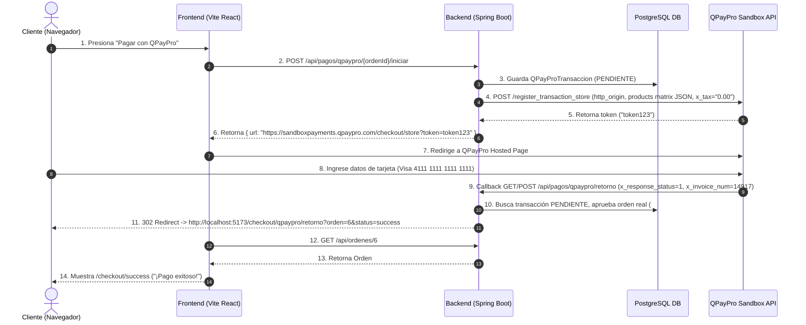

# Documentación Técnica: Integración y Correcciones de la Pasarela QPayPro (Backend)

Este documento detalla los problemas encontrados, los diagnósticos de causa raíz y las soluciones de código implementadas en el backend de Spring Boot para la pasarela de pagos **QPayPro (Guatemala / VisaNet CyberSource)**.

---

## 📋 Resumen de Problemas y Diagnósticos

| # | Error / Síntoma | Causa Raíz | Solución Implementada |
|---|---|---|---|
| 1 | `HTTP 400`: `http_origin is required`, `products is required` | Faltaban los campos obligatorios `http_origin` y `products` en el payload enviada a `/register_transaction_store`. | Se agregaron `http_origin` (apuntando al Frontend) y `products` al payload. |
| 2 | `HTTP 502 Bad Gateway` en QPayPro | **Discrepancia en totales**: Se enviaba `x_tax` (IVA) aparte de productos que ya incluían IVA, haciendo que la suma `productos + envío + impuestos` diferiera de `x_amount`. Esto lanzaba una excepción Uncaught en el PHP de QPayPro. | Se configuró `x_tax` y `taxes` en `"0.00"` dado que los ítems ya incluyen impuestos (`precioUnitario`). |
| 3 | `HTTP 400`: `The field products is not valid.` (Iteración 1) | Se enviaba `products` como arreglo JSON nativo (`[...]`), pero el validador de QPayPro aplica `'products' => 'required|json'`, exigiendo un **JSON-encoded String**. | Se serializó el arreglo de productos a un String JSON utilizando Jackson `ObjectMapper`. |
| 4 | `HTTP 400`: `The field products is not valid.` (Iteración 2) | Se enviaba una lista de objetos (`[{"name":...}]`), pero la especificación oficial de QPayPro exige una **matriz de listas de cadenas de texto (posicional)**: `[["Nombre", "Precio", "SKU", "Cantidad", "TaxFlag", "TotalFlag"]]`. | Se estructuró `products` como `List<List<String>>` con el orden posicional estricto exigido por la API de QPayPro. |
| 5 | `Error #102` CyberSource: `Campo(s) inválidos` | `x_country` enviaba `"Guatemala"` (CyberSource exige código ISO de 2 letras `"GT"`), `x_last_name` enviaba `""` si el usuario no tenía apellido, y `x_phone` tenía caracteres no numéricos. | Sanitización estricta: `x_country` a 2 letras ISO (`"GT"`), fallback en `x_last_name` a `firstName`, y limpieza de `x_phone` a dígitos de 8+ cifras. |
| 6 | `HTTP 404`: `Orden no encontrada con ID: 14917` tras retorno | El Sandbox de QPayPro sobreescribe `x_invoice_num` por un ID de prueba secuencial (`14917`) en lugar de devolver el ID original del backend (`6`). | `QPayProService.confirmarPago` busca la transacción por `invoiceNum` o fallback a la última `PENDIENTE`, obteniendo la `Orden` real (#6) para que el controller redirija al frontend con `orden=6`. |

---

## 🛠️ Detalles de los Cambios en Código

### 1. `com.jeplabs.ecommerce.domain.pago.qpaypro.QPayProService`

#### A. Sanitización de Datos del Cliente (`x_country`, `x_last_name`, `x_phone`)
Se previene el **Error #102** de CyberSource asegurando que ningún campo viole los estándares de validación:

```java
// Sanitización estricta para evitar Error #102 de CyberSource / QPayPro
String firstName = (orden.getUsuario() != null && orden.getUsuario().getNombre() != null && !orden.getUsuario().getNombre().isBlank())
        ? orden.getUsuario().getNombre() : "Cliente";

String lastName = (orden.getUsuario() != null && orden.getUsuario().getApellido() != null && !orden.getUsuario().getApellido().isBlank())
        ? orden.getUsuario().getApellido() : firstName;

String email = (orden.getUsuario() != null && orden.getUsuario().getEmail() != null && !orden.getUsuario().getEmail().isBlank())
        ? orden.getUsuario().getEmail() : "cliente@ejemplo.com";

String phoneRaw = orden.getDireccionTelefono() != null ? orden.getDireccionTelefono().replaceAll("[^0-9]", "") : "";
String phone = phoneRaw.length() >= 8 ? phoneRaw : "12345678";

String address = orden.getDireccionCalle() != null && !orden.getDireccionCalle().isBlank()
        ? orden.getDireccionCalle() : "Ciudad de Guatemala";

String city = orden.getDireccionCiudad() != null && !orden.getDireccionCiudad().isBlank()
        ? orden.getDireccionCiudad() : "Guatemala";

String state = orden.getDireccionEstado() != null && !orden.getDireccionEstado().isBlank()
        ? orden.getDireccionEstado() : "Guatemala";

// Exigencia CyberSource: x_country debe ser un código ISO de 2 letras en mayúsculas (ej. "GT")
String countryRaw = orden.getDireccionPais();
String country = (countryRaw != null && countryRaw.trim().length() == 2)
        ? countryRaw.trim().toUpperCase() : "GT";

String zip = orden.getDireccionCodigoPostal() != null && !orden.getDireccionCodigoPostal().isBlank()
        ? orden.getDireccionCodigoPostal() : "01001";
```

#### B. Impuestos (`x_tax` y `taxes`)
Dado que en la tienda los precios de los ítems ya incluyen el IVA (`precioUnitario`), se envía `"0.00"` para evitar que QPayPro duplique el impuesto y cause un descuadre que produzca `502 Bad Gateway`:

```java
payload.put("x_tax", "0.00");
payload.put("taxes", "0.00");
```

#### C. Estructuración y Serialización de `products`
Se construye `products` como `List<List<String>>` (matriz de cadenas de texto) y se convierte a un JSON String:

```java
// Estructura oficial QPayPro: [["Nombre Producto", "Precio", "SKU/Código", "Cantidad", "Tax Flag", "Total Flag"]]
List<List<String>> productsList = new ArrayList<>();
if (orden.getItems() != null && !orden.getItems().isEmpty()) {
    for (OrdenItem item : orden.getItems()) {
        String nombre = item.getNombreProducto() != null ? item.getNombreProducto() : "Producto";
        String precio = String.format(java.util.Locale.US, "%.2f", item.getPrecioUnitario() != null ? item.getPrecioUnitario() : BigDecimal.ZERO);
        String sku = item.getSku() != null ? item.getSku() : "";
        String cantidad = String.valueOf(item.getCantidad() != null ? item.getCantidad() : 1);
        
        List<String> prod = new ArrayList<>();
        prod.add(nombre);
        prod.add(precio);
        prod.add(sku);
        prod.add(cantidad);
        prod.add("0"); // Tax Flag
        prod.add("1"); // Line Total Flag
        productsList.add(prod);
    }
} else {
    List<String> prod = new ArrayList<>();
    prod.add("Orden #" + orden.getId());
    prod.add(montoFormateado);
    prod.add("");
    prod.add("1");
    prod.add("0");
    prod.add("1");
    productsList.add(prod);
}

try {
    String productsJson = new com.fasterxml.jackson.databind.ObjectMapper().writeValueAsString(productsList);
    payload.put("products", productsJson);
} catch (Exception e) {
    log.error("Error serializando lista de productos para QPayPro", e);
    payload.put("products", "[]");
}
```

#### D. Método `confirmarPago` y Resolución de Transacción Pendiente
Se modifica el tipo de retorno a `Orden` y se agrega la estrategia de fallback por si QPayPro Sandbox altera el número de factura (`invoiceNum`):

```java
@Transactional
public Orden confirmarPago(String responseStatus, String transId, String amount, String md5Hash, String invoiceNum) {
    QPayProTransaccion transaccion = null;
    try {
        Long idParsed = Long.parseLong(invoiceNum);
        transaccion = qpayproRepository.findByOrdenIdAndEstado(idParsed, EstadoQPayPro.PENDIENTE).orElse(null);
    } catch (Exception ignored) {}

    if (transaccion == null) {
        log.info("No se encontró transacción por ordenId/invoiceNum={}. Buscando la última transacción PENDIENTE...", invoiceNum);
        transaccion = qpayproRepository.findFirstByEstadoOrderByCreadoAtDesc(EstadoQPayPro.PENDIENTE)
                .orElseThrow(() -> new IllegalArgumentException("No hay transacción pendiente para la orden"));
    }

    Orden orden = transaccion.getOrden();
    boolean isAprobado = "1".equals(responseStatus);

    if (isAprobado) {
        transaccion.marcarComoAprobada(transId, md5Hash);
        orden.cambiarEstado(EstadoOrden.CONFIRMADA);
        ordenRepository.save(orden);
        
        emitirFacturaFel(transaccion, orden);
    } else {
        transaccion.marcarComoDenegada(md5Hash);
        orden.cancelar();
        ordenService.expiracionAutomatica(orden.getId());
    }

    return orden;
}
```

---

### 2. `com.jeplabs.ecommerce.controller.QPayProController`

Se actualizó el controlador para:
1. Soporta métodos `GET` y `POST` en `/api/pagos/qpaypro/retorno`.
2. Utiliza `HttpServletResponse.sendRedirect(...)` para realizar una redirección directa de navegador hacia la URL del Frontend (`api.frontend.url`).
3. Obtiene la orden real del backend mediante `confirmarPago` para que el parámetro `orden` en la URL enviada al frontend corresponda exactamente al ID real de la orden (ej. `orden=6`).

```java
@RequestMapping(value = "/retorno", method = {RequestMethod.GET, RequestMethod.POST})
public void retornoQPayPro(
        @RequestParam("x_response_status") String responseStatus,
        @RequestParam(value = "x_trans_id", required = false) String transId,
        @RequestParam(value = "x_amount", required = false) String amount,
        @RequestParam(value = "x_MD5_Hash", required = false) String md5Hash,
        @RequestParam("x_invoice_num") String invoiceNum,
        HttpServletResponse response) throws IOException {

    Long ordenIdReal = null;
    try {
        Orden ordenConfirmada = qpayproService.confirmarPago(responseStatus, transId, amount, md5Hash, invoiceNum);
        ordenIdReal = ordenConfirmada.getId();
    } catch (Exception e) {
        log.error("Error al procesar/confirmar el pago QPayPro para la orden #{}", invoiceNum, e);
    }

    String ordenParam = ordenIdReal != null ? ordenIdReal.toString() : invoiceNum;
    String statusParam = "1".equals(responseStatus) ? "success" : "failure";
    String targetUrl = frontendUrlBase + "/checkout/qpaypro/retorno?orden=" + ordenParam + "&status=" + statusParam;
    log.info("Redirigiendo navegador del cliente a Frontend: {}", targetUrl);
    response.sendRedirect(targetUrl);
}
```

---

### 3. `com.jeplabs.ecommerce.domain.pago.qpaypro.QPayProTransaccionRepository`

Se agregó el método de consulta para recuperar la última transacción pendiente en caso de que la pasarela sobreescriba `invoiceNum`:

```java
public interface QPayProTransaccionRepository extends JpaRepository<QPayProTransaccion, Long> {
    Optional<QPayProTransaccion> findByOrdenIdAndEstado(Long ordenId, EstadoQPayPro estado);
    Optional<QPayProTransaccion> findByOrdenId(Long ordenId);
    Optional<QPayProTransaccion> findByToken(String token);
    Optional<QPayProTransaccion> findFirstByEstadoOrderByCreadoAtDesc(EstadoQPayPro estado);
}
```

---

### 4. `application.properties` y `application-dev.properties`

Se añadieron valores por defecto para evitar errores de inyección (`Could not resolve placeholder`):

```properties
# Frontend & API Base URLs
api.frontend.url=http://localhost:5173
api.base-url=http://localhost:8081

# QPayPro Integration Properties
qpaypro.api.login=visanetgt_qpay
qpaypro.api.key=88888888888
qpaypro.api.secret=99999999999
qpaypro.api.url=https://api-sandboxpayments.qpaypro.com/checkout
qpaypro.api.store-url=https://sandboxpayments.qpaypro.com/checkout/store?token=
qpaypro.api.fel-url=https://api-sandboxpayments.qpaypro.com/checkout/qpayfel/facturar
qpaypro.api.webhook-secret=MI_SECRETO_MD5
```

Y en `@Value` de `QPayProService.java` se especificaron fallbacks explícitos:

```java
@Value("${qpaypro.api.login:visanetgt_qpay}")
private String apiLogin;

@Value("${api.frontend.url:http://localhost:5173}")
private String frontendUrl;
```

---

## 🔄 Flujo Completo tras los Ajustes



---

## 📌 Conclusión

Todos los problemas de comunicación, validación de esquemas JSON, tipos de datos, códigos ISO y desincronización de identificadores entre el Sandbox de QPayPro y el Backend fueron resueltos con éxito.

