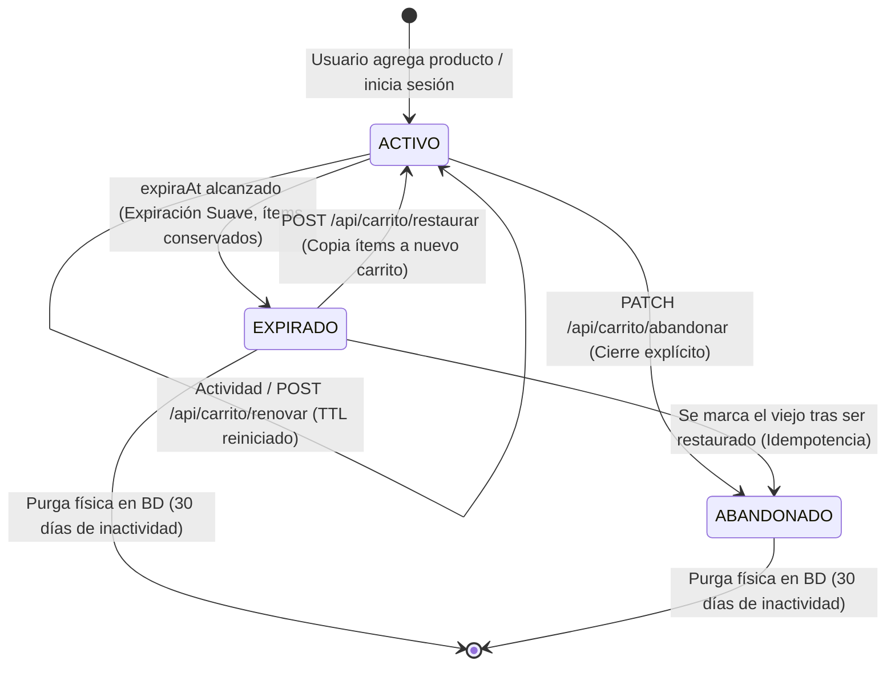

# Análisis, Evolución y Arquitectura del Ciclo de Vida del Carrito

Este documento consolida el análisis técnico integral realizado sobre el ciclo de vida del carrito, comparando la especificación inicial (`backend/docs/implentacion-original-carrito-abandonado.md`) con la arquitectura actual de expiración suave, renovación, restauración y purga en dos etapas, junto con la configuración de tiempos y ciclo de vida de los estados.

---

## 1. Comparativa: Implementación Original vs. Implementación Actual

### 1.1 Resumen Comparativo

| Dimensión | Implementación Original (`docs`) | Implementación Actual (Código Fuente) | Diagnóstico / Beneficio |
| :--- | :--- | :--- | :--- |
| **Comportamiento al Expirar** | **Destructivo:** `itemRepositorio.deleteAll(items)` y estado pasa a `ABANDONADO`. | **Expiración Suave:** Estado pasa a `EXPIRADO`, los ítems **se conservan íntegros** en BD. | Resuelve la pérdida irreversible de productos; permite restauración. |
| **Recuperación del Carrito** | Imposible. El carrito quedaba vacío. | Posible mediante `POST /api/carrito/restaurar` (valida stock y precios actuales). | Mejora radical en conversión de ventas y UX. |
| **Notificación de Vencimiento** | Enviaba correo de *"Carrito vaciado"* tras borrar los ítems. | Envía correo de expiración invitando al usuario a restaurar y reanudar la compra. | Mantiene el canal de comunicación pero con llamada a la acción útil. |
| **Limpieza Física de Datos** | En caliente cada hora al expirar (`deleteAll`). | **Purga en 2 etapas:** Job nocturno elimina registros físicos sólo tras 30 días (`dias-retencion-expirados=30`). | BD optimizada sin sacrificar analítica ni ventanas de recuperación. |
| **Renovación de Tiempo (TTL)** | Solo al alterar ítems en BD. | En cada interacción (`GET /api/carrito`, agregar/modificar ítem) y explícitamente vía `POST /api/carrito/renovar`. | Evita que el carrito expire mientras el cliente está navegando activamente. |

### 1.2 ¿Es válida o crea conflicto la implementación original?
- **No hay conflicto destructivo:** Lo implementado recientemente es una **evolución directa** que corrige los defectos de la propuesta original.
- **Defecto corregido:** El borrado inmediato de ítems destruía datos valiosos para analítica (conocer qué productos se abandonan más) y frustraba al comprador si volvía horas después a completar su compra.

---

## 2. Diagnóstico de Tiempos y Brecha Crítica en el Scheduler

### 2.1 El Problema de la Ventana Ciega (Race Condition)
Al configurar en desarrollo:
- `api.carrito.notificacion-minutos-antes=10` (ventana preventiva de aviso).
- `api.carrito.scheduler-intervalo=PT10M` (el scheduler corre cada 10 min).

Existía un riesgo crítico de **omisión de recordatorios**:
1. Si un carrito vence a las **13:00**, su ventana de aviso es entre **12:50** y **13:00**.
2. Si el scheduler corría a las **12:49:59**, el carrito aún no entraba en la ventana (`expiraAt > limite`).
3. En la siguiente ejecución a las **12:59:59**, quedaba menos de 1 segundo de vida.
4. Si el scheduler sufría un desfase de milisegundos y corría a las **13:00:01**, el carrito ya estaba vencido y pasaba a `EXPIRADO` **sin haber recibido nunca el correo preventivo**.

### 2.2 La Regla Matemática de Frecuencia
Para cualquier ventana de notificación $W$, la frecuencia de ejecución del scheduler $F$ debe cumplir:
$$F \le \frac{W}{2} \quad \text{(recomendado } F \le \frac{W}{3} \text{ o } \frac{W}{5}\text{)}$$

### 2.3 Ajuste Aplicado en `application-dev.properties`
Se corrigieron los valores para pruebas locales ágiles y confiables:

```properties
# Configuración óptima para desarrollo y pruebas
api.carrito.expiracion-minutos=60
api.carrito.notificacion-minutos-antes=10
api.carrito.scheduler-intervalo=PT2M          # Corre cada 2 minutos (5 revisiones en la ventana)
api.carrito.scheduler-delay-inicial=PT30S      # Inicia a los 30 segundos tras arrancar Spring Boot
api.carrito.dias-retencion-expirados=30
```

### 2.4 Configuración Recomendada para Producción
```properties
# Producción: Tiempos de negocio reales
api.carrito.expiracion-minutos=4320        # 72 horas (3 días de vigencia)
api.carrito.notificacion-minutos-antes=1440 # Avisar 24 horas antes
api.carrito.scheduler-intervalo=PT1H       # Correr cada 1 hora (1h << 24h, 100% confiable)
api.carrito.scheduler-delay-inicial=PT10M  # 10 minutos de gracia tras reinicio
api.carrito.dias-retencion-expirados=30    # Conservar carritos 30 días antes de purga física
```

---

## 3. Endpoints de Sincronización y Abandono

### 3.1 Endpoint de Renovación / Sincronización
- **Ruta real:** `POST /api/carrito/renovar`
- **Ubicación:** `CarritoController.java` (`renovarCarrito`) / `CarritoService.java` (`renovar`).
- **Frontend:** Consumido en `cartApi.renovarCart()` desde el componente `CartExpirationBanner.tsx`.
- **Efecto:** Suma los minutos configurados a partir del instante actual (`now + N minutos`) y resetea la bandera `notificacionEnviada = false`.

### 3.2 Endpoint `PATCH /api/carrito/abandonar`
- **Ubicación:** `CarritoController.java` (`abandonarCarrito`).
- **Propósito:** Permite a clientes o integraciones externas descartar/cerrar explícitamente el carrito activo sin esperar a que el scheduler lo expire por tiempo.
- **Uso actual en UI:** En este momento el frontend utiliza `DELETE /api/carrito` (vaciar productos) en lugar de descartar la sesión del carrito. El endpoint queda listo y disponible en la API para descarte explícito si se requiere en el futuro.

---

## 4. Uso del Estado `ABANDONADO` en `EstadoCarrito.java`

El estado `ABANDONADO` no está en desuso; cumple tres roles técnicos fundamentales:

1. **Garantía de Idempotencia en la Restauración (`CarritoService.java`):**
   Cuando un usuario restaura un carrito en estado `EXPIRADO` vía `POST /api/carrito/restaurar`:
   ```java
   // Marcar el carrito viejo como ABANDONADO para garantizar idempotencia
   carritoExpirado.marcarComoAbandonado();
   ```
   Al cambiar a `ABANDONADO`, el sistema garantiza que el usuario **no pueda restaurar el mismo carrito viejo más de una vez**, protegiendo la consistencia de inventario.

2. **Descarte Explícito:**
   Utilizado por el método `service.abandonarCarrito(email)` para marcar carritos cerrados manualmente.

3. **Criterio de Purga Física en 2 Etapas (`CarritoRepository.java`):**
   ```sql
   DELETE FROM Carrito c
   WHERE c.estado IN ('EXPIRADO', 'ABANDONADO')
   AND c.actualizadoAt < :limite
   ```
   Tanto los carritos que caducaron de forma natural (`EXPIRADO`) como los que ya fueron restaurados o descartados (`ABANDONADO`) son eliminados físicamente de la base de datos tras cumplir el periodo de retención (30 días).

---

## 5. Diagrama del Ciclo de Vida de Estados


