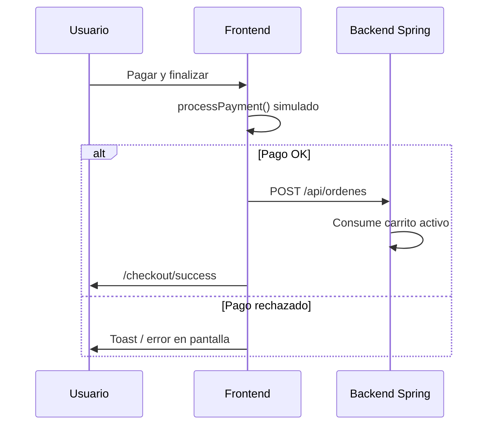
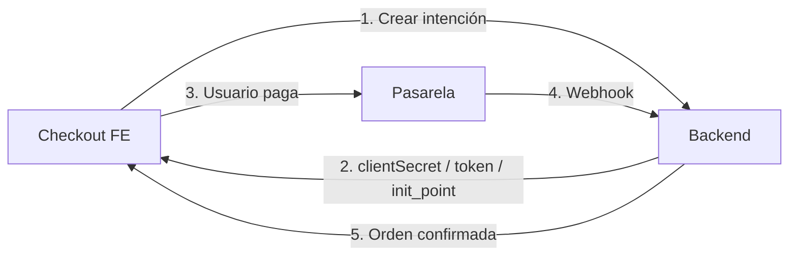

# Pasarelas de pago — checkout

Guía del **modo demo actual** (Stripe, Webpay Plus y Mercado Pago simulados) y de cómo migrar a **integraciones reales** en frontend y backend.

---

## Modo actual (simulado)

El checkout **no llama a pasarelas externas**. Todo ocurre en el navegador:

| Archivo | Rol |
|---------|-----|
| `features/checkout/api/paymentApi.ts` | `processPayment()` — validación demo y respuesta ficticia |
| `features/checkout/model/schemas/payment.ts` | Tipos Zod: `PaymentMethod`, `PaymentResult`, tarjeta Stripe |
| `features/checkout/model/useCheckoutLogic.ts` | Orquesta pago simulado → `POST /api/ordenes` |
| `features/checkout/ui/PaymentStep/` | Selector de método + formularios demo |
| `features/checkout/ui/Simulated*Form/` | UI por proveedor |

### Flujo demo



**Importante:** la orden se crea **después** del pago simulado. En producción conviene invertir o usar idempotencia + webhooks (ver más abajo).

### Métodos demo

| Método | UI | Éxito en demo |
|--------|-----|----------------|
| `stripe` | Formulario tarjeta | `4242 4242 4242 4242` |
| `webpay` | Redirección simulada | Siempre aprueba tras ~2,2 s |
| `mercadopago` | Checkout Pro simulado | Siempre aprueba tras ~1,9 s |
| `transferencia` | Datos bancarios + pedido pendiente | Sin pasarela; orden `PENDIENTE` |

Tarjeta rechazada Stripe demo: `4000 0000 0000 0002`.

Tarjeta aprobada Mercado Pago (referencia producción): `5031 4332 1540 6351`.

### Transferencia bancaria (solo frontend)

Implementación **sin cambios en el backend** (workaround temporal):

| Qué | ¿Backend? | Dónde |
|-----|-----------|--------|
| Crear orden | ✅ Sí — `POST /api/ordenes` | Spring Boot |
| Método «transferencia» | ❌ No | `localStorage` (`ecommerce:ordenes-transferencia`) |
| Comprobante (archivo) | ❌ No | `localStorage` (`ecommerce:comprobantes-transferencia`, base64) |

**No es la mejor práctica en producción.** El navegador del cliente no es un servidor de archivos: se pierde al limpiar datos, no lo ven otros dispositivos ni el admin, y no hay validación centralizada. Lo correcto sería:

1. Campo `metodoPago` en la orden (backend).
2. `POST /api/ordenes/{id}/comprobante` con `multipart/form-data`.
3. Almacenamiento en disco/S3 y URL persistida en la orden.

Se usó `localStorage` porque pediste **no modificar el backend** en esa iteración; es solo demo hasta integrar esos endpoints.

| Archivo | Rol |
|---------|-----|
| `lib/bank-transfer-accounts.ts` | Dos cuentas demo para depositar/transferir |
| `lib/transfer-order-storage.ts` | `localStorage`: qué órdenes son por transferencia y comprobante (base64) |
| `ui/SimulatedBankTransferForm/` | Cuentas en el paso de pago |
| `ui/OrderBankTransferSection/` | Cuentas + subida de comprobante en detalle de pedido (solo transferencia) |

Flujo:

1. Usuario elige **Transferencia bancaria** → ve las cuentas.
2. **Confirmar pedido** → `POST /api/ordenes` (estado `PENDIENTE` en backend) **sin** `processPayment()`.
3. Se marca `orden.id` en `localStorage` como transferencia.
4. En **Mi perfil → Pedidos**, al abrir esa orden: datos bancarios + formulario de comprobante.
5. El comprobante se guarda en `localStorage` (demo). **Producción:** subir archivo al backend (`POST /api/ordenes/{id}/comprobante`), persistir `metodoPago` en la orden y notificar al admin.

---

## Arquitectura recomendada en producción

Patrón común para las tres pasarelas:

1. **Backend** crea la intención de pago (Payment Intent, transacción Webpay, preferencia MP) con el monto final.
2. **Frontend** muestra UI del proveedor (Elements, redirect o Brick) **sin** secret keys.
3. **Webhook / IPN** confirma el pago en el servidor.
4. **Backend** marca la orden como pagada y responde al frontend.



### Cambios transversales en backend (Spring Boot)

| Componente | Descripción |
|------------|-------------|
| `PaymentController` | Endpoints por proveedor (`/api/pagos/stripe/intent`, `/webpay/iniciar`, `/mercadopago/preferencia`) |
| `PaymentService` | Lógica por pasarela; nunca exponer secret keys al frontend |
| Tabla `pagos` o campos en `ordenes` | `provider`, `external_id`, `status`, `amount`, `raw_payload` |
| Webhooks | Rutas públicas firmadas: `/api/webhooks/stripe`, `/webhooks/transbank`, `/webhooks/mercadopago` |
| Config | `application-prod.properties`: claves por entorno (test/live) |
| Idempotencia | Clave por `orderReference` o `ordenId` para evitar doble cobro |

Variables típicas:

```properties
# Stripe
stripe.secret-key=sk_test_...
stripe.webhook-secret=whsec_...

# Transbank (Webpay Plus)
transbank.commerce-code=...
transbank.api-key=...
transbank.environment=integration

# Mercado Pago
mercadopago.access-token=TEST-...
mercadopago.webhook-secret=...
mercadopago.notification-url=https://tu-dominio.com/api/webhooks/mercadopago
```

---

## Stripe — implementación real

**Documentación:** [Stripe Payments](https://docs.stripe.com/payments) · [Payment Intents](https://docs.stripe.com/payments/payment-intents)

### Enfoque recomendado: Payment Element

1. **Backend** — crear Payment Intent:

```java
// POST /api/pagos/stripe/intent
// Body: { "ordenId": 123 } o datos de checkout antes de orden
PaymentIntent intent = PaymentIntent.create(
    PaymentIntentCreateParams.builder()
        .setAmount(totalEnCentavos)
        .setCurrency("clp") // o "usd", según tu mercado
        .setAutomaticPaymentMethods(
            PaymentIntentCreateParams.AutomaticPaymentMethods.builder()
                .setEnabled(true).build())
        .putMetadata("orderReference", orderReference)
        .build()
);
return Map.of("clientSecret", intent.getClientSecret());
```

2. **Frontend** — sustituir `SimulatedStripeForm` por Stripe.js:

```bash
pnpm add @stripe/stripe-js @stripe/react-stripe-js
```

```tsx
import { loadStripe } from '@stripe/stripe-js';
import { Elements, PaymentElement } from '@stripe/react-stripe-js';

const stripePromise = loadStripe(import.meta.env.VITE_STRIPE_PUBLISHABLE_KEY);

// Tras obtener clientSecret del backend:
<Elements stripe={stripePromise} options={{ clientSecret }}>
  <PaymentElement />
</Elements>
```

3. **Confirmar pago** (frontend):

```tsx
const { error } = await stripe.confirmPayment({
  elements,
  confirmParams: { return_url: `${origin}/checkout/stripe/return` },
});
```

4. **Webhook** — `payment_intent.succeeded`:

```java
@PostMapping("/api/webhooks/stripe")
public ResponseEntity<String> stripeWebhook(
        @RequestBody String payload,
        @RequestHeader("Stripe-Signature") String sig) {
    Event event = Webhook.constructEvent(payload, sig, webhookSecret);
    if ("payment_intent.succeeded".equals(event.getType())) {
        // Marcar orden pagada, idempotente por paymentIntent.id
    }
    return ResponseEntity.ok("received");
}
```

5. **Sustituir** `paymentApi.processPayment` por llamada al backend + `confirmPayment`, o mover toda la confirmación al return URL + webhook.

### Checklist Stripe

- [ ] Publishable key solo en frontend (`VITE_STRIPE_PUBLISHABLE_KEY`)
- [ ] Secret key y webhook secret solo en backend
- [ ] Montos en centavos/unidad mínima de la moneda
- [ ] No confiar solo en el redirect del cliente; usar webhook
- [ ] Modo test con tarjetas de [Stripe Testing](https://docs.stripe.com/testing)

---

## Webpay Plus (Transbank) — implementación real

**Documentación:** [Transbank Developers — Webpay Plus](https://developers.transbank.cl/)

Webpay es **redirect**: el usuario sale de tu sitio, paga en Transbank y vuelve a tus URLs de retorno.

### Flujo

1. **Backend** — crear transacción:

```java
// POST /api/pagos/webpay/iniciar
// Usar SDK oficial: com.github.transbank:transbank-sdk-java
WebpayPlusTransaction tx = WebpayPlus.Transaction.buildForIntegration(...);
CreateResponse response = tx.create(
    buyOrder,      // único, max 26 chars
    sessionId,
    amount,
    returnUrl      // https://tu-dominio.com/checkout/webpay/return
);
return Map.of("token", response.getToken(), "url", response.getUrl());
```

2. **Frontend** — reemplazar `SimulatedWebpayForm`:

```tsx
// Tras POST /api/pagos/webpay/iniciar:
window.location.href = url; // redirección a Transbank
// O form POST con token según documentación Transbank
```

3. **Return URL** — página `CheckoutWebpayReturnPage`:

```tsx
// URL trae token_ws
await fetch('/api/pagos/webpay/confirmar', {
  method: 'POST',
  body: JSON.stringify({ token: tokenWs }),
});
// Backend hace commit() y devuelve estado + orden
```

4. **Backend** — confirmar:

```java
CommitResponse commit = tx.commit(token);
// Si responseCode == 0 → pago OK → crear/confirmar orden
```

### Checklist Webpay

- [ ] `buy_order` único por transacción
- [ ] Ambiente integration vs production en SDK
- [ ] Manejar rechazo (`responseCode != 0`) y timeout
- [ ] No crear la orden definitiva hasta `commit` exitoso (o reservar stock con expiración)
- [ ] Certificado/commerce code en variables de entorno

---

## Mercado Pago — implementación real

**Documentación:** [Mercado Pago Developers](https://www.mercadopago.com.ar/developers/es/docs)

Hay dos caminos habituales:

| Opción | Uso típico |
|--------|------------|
| **Checkout Pro** | Redirect a página de MP (similar a Webpay) |
| **Payment Brick / Card Payment Brick** | Formulario embebido en tu checkout (similar a Stripe Elements) |

### Opción A — Checkout Pro (redirect)

1. **Backend** — crear preferencia:

```java
// POST /api/pagos/mercadopago/preferencia
// SDK: com.mercadopago:sdk-java
PreferenceClient client = new PreferenceClient();
PreferenceRequest request = PreferenceRequest.builder()
    .items(List.of(
        PreferenceItemRequest.builder()
            .title("Pedido " + orderReference)
            .quantity(1)
            .unitPrice(new BigDecimal(total))
            .build()))
    .backUrls(PreferenceBackUrlsRequest.builder()
        .success("https://tu-dominio.com/checkout/mercadopago/success")
        .failure("https://tu-dominio.com/checkout/mercadopago/failure")
        .pending("https://tu-dominio.com/checkout/mercadopago/pending")
        .build())
    .autoReturn("approved")
    .externalReference(orderReference)
    .notificationUrl("https://tu-dominio.com/api/webhooks/mercadopago")
    .build();
Preference preference = client.create(request);
return Map.of("initPoint", preference.getInitPoint());
```

2. **Frontend** — sustituir `SimulatedMercadoPagoForm`:

```tsx
const { initPoint } = await crearPreferencia(orderTotal, orderReference);
window.location.href = initPoint;
```

3. **Webhook IPN** — confirmar pago:

```java
@PostMapping("/api/webhooks/mercadopago")
public ResponseEntity<Void> mercadoPagoWebhook(@RequestParam Map<String, String> params) {
    // Recibir topic=payment, id=...
    // GET /v1/payments/{id} con access token
    // Si status == approved → confirmar orden por external_reference
    return ResponseEntity.ok().build();
}
```

### Opción B — Payment Brick (embebido)

```bash
pnpm add @mercadopago/sdk-react
```

```tsx
import { initMercadoPago, Payment } from '@mercadopago/sdk-react';

initMercadoPago(import.meta.env.VITE_MERCADOPAGO_PUBLIC_KEY);

<Payment
  initialization={{ amount: orderTotal, preferenceId: preferenceIdFromBackend }}
  onSubmit={async ({ formData }) => {
    await fetch('/api/pagos/mercadopago/procesar', {
      method: 'POST',
      body: JSON.stringify(formData),
    });
  }}
/>
```

El backend procesa el pago con el token generado por el Brick (endpoint `/v1/payments`).

### Tarjetas de prueba Mercado Pago

| Resultado | Número (ejemplo) |
|-----------|------------------|
| Aprobada | `5031 4332 1540 6351` |
| Rechazada | `5031 7557 3453 0604` |

Ver [tarjetas de prueba](https://www.mercadopago.com.ar/developers/es/docs/checkout-api/integration-test/test-cards) según país.

### Checklist Mercado Pago

- [ ] Access Token en backend; Public Key en frontend si usas Brick
- [ ] `external_reference` = ID de orden o referencia única
- [ ] Webhook + consulta de pago por API (no confiar solo en back_urls)
- [ ] Manejar estados `pending` (efectivo, etc.)
- [ ] Credenciales TEST vs PROD por país (CL, AR, MX…)

---

## Migración desde el código demo

### Frontend

1. Añadir variables `VITE_*` por proveedor en `.env.example`.
2. Crear `features/checkout/api/stripeApi.ts`, `webpayApi.ts`, `mercadopagoApi.ts` que llamen al backend real.
3. Reemplazar `processPayment()` en `useCheckoutLogic` por el flujo del proveedor elegido.
4. Mantener `PaymentSuccessResult` como contrato hacia `OrderConfirmationSummary` (provider, transactionId, authorizationCode).
5. Rutas de retorno: `/checkout/webpay/return`, `/checkout/mercadopago/success`, etc.

### Backend

1. Endpoints de inicio/confirmación de pago (no mezclar con `OrdenService.crear` hasta tener pago confirmado, o usar estados `PENDIENTE_PAGO`).
2. Persistir referencia de pasarela en la orden.
3. Webhooks idempotentes.
4. Tests de integración con sandboxes.

### Orden de operaciones recomendada

| Paso actual (demo) | Producción recomendada |
|--------------------|------------------------|
| 1. Pago simulado FE | 1. Crear orden en estado `PENDIENTE_PAGO` o reserva |
| 2. POST orden | 2. Iniciar pago en pasarela |
| — | 3. Webhook confirma → orden `CONFIRMADA` |
| — | 4. Frontend muestra success con polling o redirect |

Evita cobrar en frontend sin webhook: el usuario puede cerrar el navegador tras pagar.

---

## Referencias rápidas

| Proveedor | SDK backend (Java) | SDK frontend |
|-----------|-------------------|--------------|
| Stripe | `com.stripe:stripe-java` | `@stripe/stripe-js`, `@stripe/react-stripe-js` |
| Webpay Plus | `com.github.transbank:transbank-sdk-java` | Redirect (sin SDK FE obligatorio) |
| Mercado Pago | `com.mercadopago:sdk-java` | `@mercadopago/sdk-react` (Brick) o redirect |

---

## Archivos demo a tocar al pasar a producción

```
frontend/src/features/checkout/api/paymentApi.ts          → delegar al backend
frontend/src/features/checkout/ui/SimulatedStripeForm/    → Stripe Payment Element
frontend/src/features/checkout/ui/SimulatedWebpayForm/      → redirect Transbank
frontend/src/features/checkout/ui/SimulatedMercadoPagoForm/ → redirect o Brick MP
frontend/src/features/checkout/model/useCheckoutLogic.ts    → flujo async + return URLs
```

Documentación relacionada: [architecture-fsd.md](./architecture-fsd.md) (checkout y orden).
